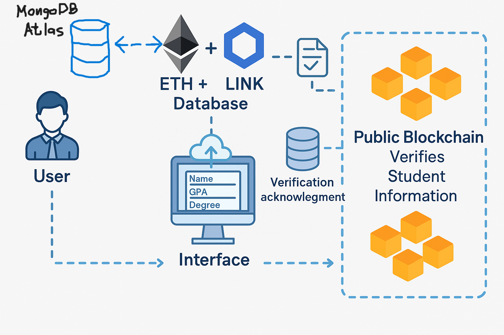

# 🔐 Blockchain-Based Applicant Verification System

A full-stack decentralized application (dApp) that allows universities, companies, and applicants to verify academic and professional credentials using Ethereum smart contracts and simulated Chainlink oracles.

---



---

## 🧠 Project Overview

This system enables trustless verification of:

- 🎓 **Degree**
- 💼 **Company Work Experience**
- 📜 **University GPA**

It combines:

- **Blockchain** (Ethereum + Truffle + Ganache)
- **Smart Contracts** (Solidity)
- **Backend API** (FastAPI + MongoDB + Web3.py)
- **Chainlink-inspired Oracle Simulation**
- **React Frontend** with Web3 integration
- **MongoDB Atlas** for record storage

---

## 🗂 Folder Structure

```
Blockchain Based Applicant Verification/
├── backend/            # FastAPI + MongoDB + Web3.py logic
├── frontend/           # React.js frontend UI
├── blockchain/         # Solidity contracts + Truffle + Ganache
└── README.md           # Main project overview
```

---

## 🚀 How to Run the Project

### 🧱 1. Blockchain (Truffle + Ganache)

```bash
cd blockchain
npm install
npm install -g truffle

# Start Ganache UI (recommended)
# OR use ganache-cli:
ganache-cli --port 7545

# In a new terminal:
truffle compile
truffle migrate
```

> Recommend to follow blockchain directory README.md file to detailed setup and initialization.

---

### 🧠 2. Backend (FastAPI + MongoDB)

```bash
cd backend
python -m venv venv
source venv/bin/activate

venv\Scripts\activate  # On Windows
# OR source venv/bin/activate  # On macOS/Linux

pip install -r requirements.txt

python -m uvicorn app.main:app --reload
```

FastAPI docs: [http://localhost:8000/docs](http://localhost:8000/docs)

> Configure `.env` with your MongoDB URI, Chain ID, and Private Key if needed.

---

### 🌐 3. Frontend (React + Web3)

```bash
cd frontend
npm install
npm run dev
```

Frontend available at: [http://localhost:5173](http://localhost:5173)

---

## 🔧 Technologies Used

| Layer          | Tech Stack                     |
| -------------- | ------------------------------ |
| Smart Contract | Solidity, Truffle, Ganache     |
| Oracle Sim     | Python, FastAPI, Web3.py       |
| Database       | MongoDB Atlas                  |
| API Server     | FastAPI, Pydantic              |
| Frontend UI    | React.js, Vite, Axios, Web3.js |

---

## 🛠 Features

- **Verification Types**: Support for GPA, employment history, and university degrees
- **Oracle Simulation**: Backend services that mimic Chainlink oracle behavior
- **Immutable Records**: All verification results stored on blockchain with timestamps
- **Gas Optimization**: Efficient contract design with proper gas configuration
- **Responsive UI**: Clean interface for submitting and checking verification status
- **Data Privacy**: Only verification results stored on-chain, not sensitive data

---

## 🌐 API Endpoints

- `POST /verification/gpa` - Verify an applicant's GPA
- `POST /verification/degree` - Verify an applicant's university degree
- `POST /verification/employment` - Verify an applicant's work experience
- `GET /verification/list` - Get all stored verifications from the blockchain
- `GET /verification/status` - Get blockchain connection status

---

## 📊 Smart Contract Functions

- `storeVerificationResult(bytes32 dataHash, bool isVerified, uint8 verificationType, string memory details)`
- `getVerificationStatus(bytes32 dataHash)`
- `verificationExists(bytes32 dataHash)`
- `getVerificationCount()`
- `getVerificationHashAtIndex(uint256 index)`

---

## 📝 Implementation Notes

### Blockchain

- Uses local Ganache blockchain for development
- Contract deployed at address: `0xb09bCc172050fBd4562da8b229Cf3E45Dc3045A6`
- Increased gas limit (1,000,000) to handle complex verification storage operations

### Oracle Simulation

- Backend services mimic Chainlink oracle nodes
- Verification requests trigger database lookups
- Results stored on blockchain with appropriate credentials
- Multiple verification types supported (GPA, degree, employment)

### Data Flow

1. Frontend submits verification request
2. Backend oracle simulates external data verification
3. Result is stored on blockchain with appropriate data hash
4. Frontend can query status using the verification hash

---

## 📜 Future Improvements

- Integrate real Chainlink oracle network
- Add role-based authentication for verifiers
- Implement IPFS storage for credential documents
- Build mobile application for verification checks
- Add email notifications for verification status changes

---

## 👨‍💻 Contributors

- Praneeth Fernando
- Eshin Fernando
- Matheesha Fernando
- Pawan Epa
- Asith Ekanayake

---

## 📄 License
