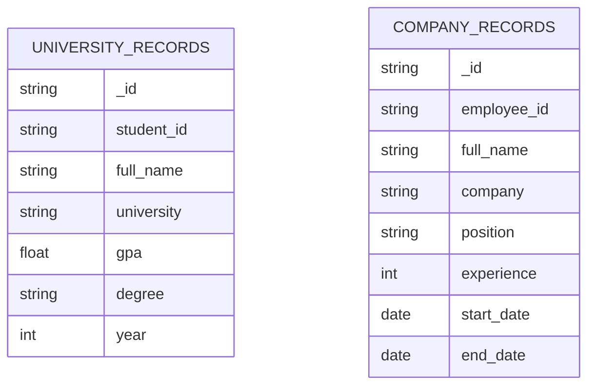

# 📦 Backend: Mock Database Schema Documentation

This documentation describes the structure and behavior of the **mock MongoDB database** used in the Backend service of the Blockchain-Based Applicant Verification System. It includes collection schemas, relationships, ER diagrams, sample queries, and mock migration tools.

---

## 📘 Overview

The backend uses **MongoDB (Atlas/local)** to store mock academic and employment records for applicants. These records are referenced by the FastAPI server and verified via a simulated blockchain and oracle.

---

## 🗂️ Collections Structure

### 🔹 `university_records`

Stores academic transcripts and degrees.

| Field        | Type     | Description               |
| ------------ | -------- | ------------------------- |
| `_id`        | ObjectId | Unique identifier         |
| `student_id` | String   | Unique student identifier |
| `full_name`  | String   | Student's full name       |
| `university` | String   | University name           |
| `gpa`        | Float    | Grade Point Average       |
| `degree`     | String   | Degree title              |
| `year`       | Int      | Year of graduation        |

---

### 🔹 `company_records`

Stores employment credentials.

| Field         | Type     | Description                       |
| ------------- | -------- | --------------------------------- |
| `_id`         | ObjectId | Unique identifier                 |
| `employee_id` | String   | Unique employee identifier        |
| `full_name`   | String   | Employee's full name              |
| `company`     | String   | Company name                      |
| `position`    | String   | Job title                         |
| `experience`  | Int      | Years of experience               |
| `start_date`  | Date     | Start date of employment          |
| `end_date`    | Date     | End date of employment (nullable) |

---

## 🔗 Relationships

While MongoDB is NoSQL and doesn't enforce foreign keys, the following **logical references** exist:

- `student_id` (in `university_records`) ↔ verified in blockchain smart contract
- `employee_id` (in `company_records`) ↔ verified in blockchain smart contract

---

## 📊 ER Diagram



---

## 🔍 Sample Queries

### 📌 1. Get student record by student_id

```python
record = university_collection.find_one({"student_id": "S2025001"})
```

### 📌 2. Get employee record by full name

```python
record = company_collection.find_one({"full_name": "John Smith"})
```

### 📌 3. List all records from a specific university

```python
records = university_collection.find({"university": "University of Colombo"})
```

---

## 🔧 Migration Strategy (for mock data)

Since we're using mock data for testing, no complex migration tools are required. Instead:

- Initial data is stored in:
  - `data/university_records.json`
  - `data/company_records.json`
- These JSON files are loaded at FastAPI startup via `mock_db.py`.

> If needed in the future, consider using:

- [Mongo-Migrate](https://github.com/tylerwince/mongo-migrate) – simple migration tool
- [MongoDB's native mongodump/mongorestore](https://www.mongodb.com/docs/database-tools/) for backup and restore

---

## 📂 File References

- `app/services/mock_db.py` – MongoDB logic
- `data/university_records.json` – Sample student records
- `data/company_records.json` – Sample employment records

---

## 📌 Notes

- No sensitive user data is stored.
- Mock data is non-persistent and meant for local testing only.
- Replace mock logic with real data sources and APIs in production.
