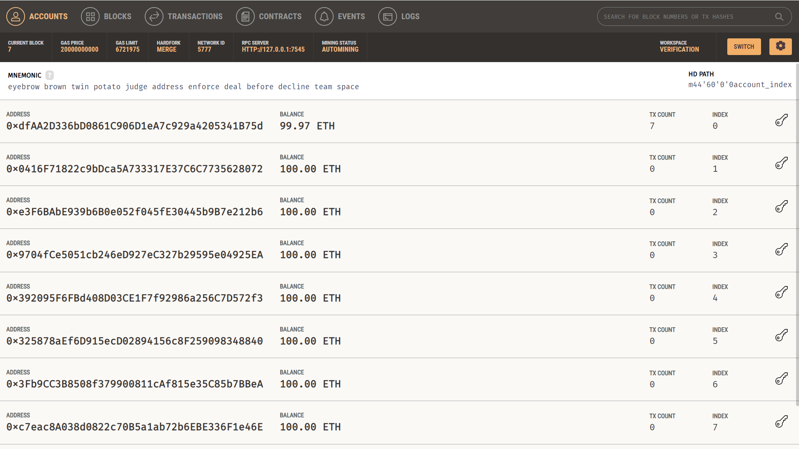

# Blockchain – Solidity + Truffle + Ganache

This folder contains smart contracts and local blockchain simulation tools for the **Blockchain-Based Applicant Verification** system.

---

## ⚙️ Tech Stack

- Solidity
- Truffle
- Ganache (Local Ethereum blockchain)
- Web3.js
- Node.js

---

## 🚀 Getting Started

### 1. Install dependencies

```bash
npm install
```

### 2. Install Truffle globally

```bash
npm install -g truffle
```

### 3. Start local blockchain (Ganache)

```bash
ganache-cli --port 7545
```

Alternatively, open Ganache GUI and select port `7545`.

**_Note:_**

- recomend to use ganache GUI otherwise you loss your previous records because, when you run `truffle migrate` it will automatically regenerate address again

    

#### Step-by-Step:

1. **Download Ganache UI (Desktop App)**  
   From: [https://trufflesuite.com/ganache](https://trufflesuite.com/ganache/)

2. **Open Ganache and Create a Workspace**

   - Click **"New Workspace"**
   - Name it something like `GPA Verification`
   - Under the **Truffle Projects** section:
     - Add your Truffle project folder
   - You can also configure the port (default is 7545)

3. **Click "Save Workspace"**

   - This saves your **accounts**, **deployed contracts**, and **blockchain state** to disk.
   - Ganache will now **remember everything** between sessions.

4. **Start Ganache from the Workspace Each Time**

   - Use the same workspace every time
   - Your contract address and stored blockchain data stay the same

5. **Run Truffle Migrate Once**
   ```bash
   truffle migrate
   ```
   - This deploys the contract to Ganache
   - The address stays fixed between restarts

### 4. Compile and deploy smart contracts

```bash
truffle compile
truffle migrate
```

### 5. Setup mock verifications (optional - testing only)

Populate the contract with test verification data:

```bash
node scripts/setup_mock_verifications.js
```

---

## 📂 Folder Structure

```
blockchain/
├── contracts/
│   └── Verification.sol         # Solidity contract
├── migrations/
│   └── 1_deploy_contracts.js    # Truffle deployment script
├── scripts/
│   ├── deploy.js                # Web3-based deploy script
│   └── setup_mock_verifications.js # Populate contract with test data
├── test/
│   └── verification_test.js     # Contract test cases
├── truffle-config.js            # Network config
└── README.md
```

---

## 📝 Verification Contract Features

The `Verification.sol` contract provides:

- **Verification storage**: Store verification results with data hash, timestamp, and verification type
- **Oracle authentication**: Only trusted oracle addresses can store verification results
- **Verification types**: Support for GPA, employment, degree, and certificate verifications
- **Query functions**: Look up verification status by data hash
- **History tracking**: Maintain a searchable record of all verifications

### Contract Functions

- `storeVerificationResult(bytes32 dataHash, bool isVerified, uint8 verificationType, string memory details)`
- `getVerificationStatus(bytes32 dataHash)`
- `verificationExists(bytes32 dataHash)`
- `getVerificationCount()`
- `getVerificationHashAtIndex(uint256 index)`

---

## ⚙️ Configuration

### Environment Variables

Create a `.env` file to store sensitive information:

```
CONTRACT_ADDRESS=0xb09bCc172050fBd4562da8b229Cf3E45Dc3045A6
BLOCKCHAIN_PROVIDER=http://localhost:7545
PRIVATE_KEY=your_private_key_here
```

### `truffle-config.js`

```javascript
module.exports = {
  networks: {
    development: {
      host: "127.0.0.1",
      port: 7545,
      network_id: "*", // Match any network ID
      gas: 6721975, // Gas limit
    },
  },
  compilers: {
    solc: {
      version: "0.8.21",
      settings: {
        optimizer: {
          enabled: true,
          runs: 200,
        },
      },
    },
  },
};
```

---

## 🔗 Using the Deployed Contract

After deployment, the contract address is saved to `deployed_contract_address.json`. Use this address to:

1. Update the environment variables in other parts of the application:

   - Add to `backend/.env` as `CONTRACT_ADDRESS`
   - Add to `frontend/.env` as `REACT_APP_CONTRACT_ADDRESS`

2. Interact with the contract via scripts:

   ```bash
   node scripts/setup_mock_verifications.js
   ```

3. Verify the contract is working:

   ```bash
   truffle console --network development
   ```

   ```javascript
   let v = await Verification.deployed();
   let count = await v.getVerificationCount();
   count.toString(); // Should return the number of verifications
   ```

---

## 🧪 Testing

Run contract tests to ensure everything is working:

```bash
truffle test
```

This will execute all tests in the `test/` directory and verify the contract functions correctly.
